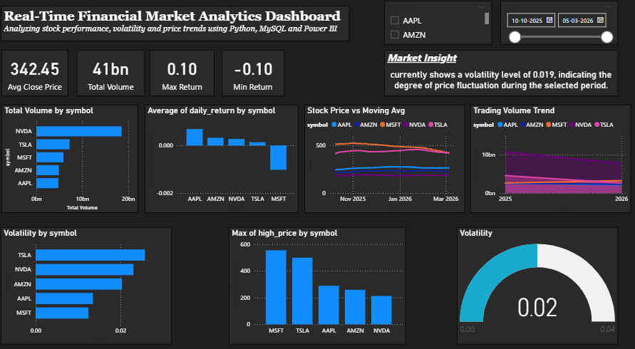

# Stock Market Analytics Dashboard

## Overview
This project analyzes stock market performance using Python, MySQL, and Power BI.
The dashboard visualizes stock price trends, volatility, returns, and trading volume for major tech companies.

## Technologies Used
Python
Pandas
NumPy
MySQL
Power BI
Data Visualization

## Dataset
Historical stock data for:
- AAPL
- AMZN
- MSFT
- NVDA
- TSLA

## Features
• Data cleaning and preprocessing using Python  
• Financial metrics calculation (daily returns, moving averages, volatility)  
• SQL queries for structured data analysis  
• Interactive Power BI dashboard with KPIs and charts  
• Dynamic filters for stock comparison  

## Predictive Analysis
A linear regression model was used to forecast future stock prices based on historical data.

Example insight:
The prediction trend for TSLA shows a slight downward price trend over the analyzed period.

## Dashboard Preview

## Project Workflow
Data Collection → Data Cleaning → Feature Engineering → SQL Analysis → Power BI Dashboard

## Author
Shradhakavile
